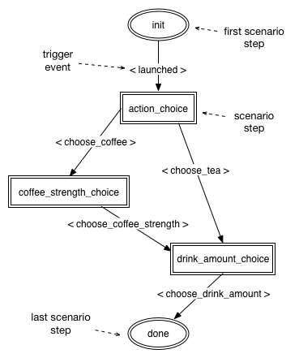

# Alexa Flask-ASK Guide library

[](https://travis-ci.org/dgtony/afg)

Library for building scenario-based conversational skills for voice communication service Amazon Alexa in Python. It is intended to be used jointly with the [Flask ASK](https://github.com/johnwheeler/flask-ask) framework.

## Install
Package installation is trivial:

```
pip install afg
```

Tested on Python >= 3.4.


## Usage
Lets consider a simple example to understand how the library works. Imagine that you are creating Alexa skill to control some kitchen device. This device can make you a coffee or a tea, depending on your choice. If you choose to make a coffee device can vary its strength (for simplicity: `weak` or `strong`). Drink amount is adjustble as well.

So your skill logic should include choice of drink, its amount and coffee strength if you prefer coffee. At first you need to create corresponding intents, e.g.: `ChooseCoffeeIntent`, `ChooseTeaIntent`, `CoffeeStrengthIntent`, `DrinkAmountIntent`. Ok, now you can send desired signals and parameters to your skill, but there is still a problem. Due to asynchronous Alexa nature your intents could be invoked in an arbitrary order: intent activating utterances could sound similar, or user say something unexpected etc. - result is wrong order of calls.
In fact what you need here, is following the steps of some dialog scenario, and this is where the library can help.

### Dialog scenario

Desired sequence of calls could be formally defined with the following diagram.



Our scenario has an entry point where all conversations starts - *first step* of the scenario, give it a name: `init`. Consequently there must be a *last step* - call it `done`.

**Note**: actually first and last steps here are kind of artificial entities, because your dialog always starts with `launched` trigger and can be finished in the different states. They are introduced mainly in order to make a graph of state machine transitions consistent and easy to analyse.

Between the first and the last there are intermediate *steps*, invoked by the *event triggers*. To distinguish it easily we give the steps noun-based names and for the events they are verb-based.

Now we need to inform our library about desired scenario flow. It can be done with a special YAML-file where all steps are described as follows.


```yaml
# start and finish steps in scenario
first_step: init
last_step: done
default_help:
  - "You are talking to Alexa. What drink would you like?"
  - "Hi, I'm your barista, would you like tea or coffee?"


steps:
  # minimal description for the first step
  init:
    events:
      launched:
        next: drink_choice

  # step name
  drink_choice:
    # if wrong intent was invoked, ask user again with one of the phrases (random choice)
    reprompt:
      - "Sorry, I didn't understand, would you like tea or coffee?"
      - "Please, choose tea or coffee"
    # help phrases for the current step
    help:
      - "You need to decide what drink you want. Say: tea or coffee"
      - "Just say: tea or coffee"
    events:
      # event trigger #1
      choose_tea:
        # where to move from here?
        next: drink_amount_choice
      # event trigger #2
      choose_coffee:
        next: coffee_strength_choice

  coffee_strength_choice:
    reprompt:
      - "Sorry, I didn't understand, what is your desired coffee strength?"
      - "Say it again, what coffee strength do you prefer?"
    help:
      - "Say brew it weak or brew it strong"
      - "Please define coffee strength: weak or strong?"
    events:
      choose_coffee_strength:
        next: drink_amount_choice

  drink_amount_choice:
    reprompt:
      - "Sorry, I didn't understand, how big your drink must be?"
      - "Please say, should it be small or big?"
    help:
      - "On the current step you need to choose amount of your drink"
      - "Say small or big"

    events:
      choose_drink_amount:
        next: done

# no need to describe last step
  done:
```

*Note: afg >= 0.2.0 use lists of reprompt and help phrases instead of single phrases in the previous versions. Do not forget to update your scenarios!*


In the fields `first_step` and `last_step` one just define names of the first and the last scenario steps. Next field `default_help` we will discuss a bit later.

Lets take a look at step definitions in section `steps`. Each step has following properties:

* *reprompt* - this is a phrase that will be returned to user if unexpected intent handler was invoked; unexpected are all handlers not defined in `events` section of current step;
* *help* - context help string for current step;
* *events* - here all possible step transitions are defined.

In section `events` we set next scenario steps for the certain events. Library treats name of the Flask-Ask function handling some intent as event name. E.g. according to our scenario file function that serves `ChooseCoffeeIntent` must be called `choose_coffee`.


### Build the skill
Ok, lets build a skill implementing our scenario! For this purpose we will use Flask Ask - Alexa Skill Kit for Python.

At first we need to create *supervisor* - object that guides all the movements through the scenario, giving it our scenario description file.

```python
from flask import Flask, render_template
from flask_ask import Ask, statement, question, session, convert_errors
from afg import Supervisor

app = Flask("Alexa drinks")
ask = Ask(app, '/')
sup = Supervisor("scenario.yaml")
```

At the start supervisor verifies scenario description file and in case of inconsistency corresponding error is raised.

Now we need to define start and stop events.

```python

@ask.on_session_started
@sup.start
def new_session():
    app.logger.debug('new session started')


@sup.stop
def close_user_session():
    app.logger.debug("user session stopped")


@ask.session_ended
def session_ended():
    close_user_session()
    return "", 200
```

When user session starts we need to inform supervisor about it with simple `start` decorator. Please note that order of stacked decorators matters: `ask.on_session_started` must precede `sup.start` for the proper initialization.

Open sessions also must be properly cleaned after conversation with `close_user_session` function. Maximum session lifetime by default is one hour. After that time all idle (unused) sessions in supervisor will be forced closed and its state machines will be removed.

It is very convinient to give user help information depending on the current step. 

```python
@ask.intent('AMAZON.HelpIntent')
def help_user():
    context_help = sup.get_help()
    return question(context_help)
```
Method `get_help` allows one to get help information defined in scenario file in section `help` for the current step. If there is no help for current step in scenario, default help (defined in global field `default_help`) will be returned. Method returns a simple string, so you can add some dynamic content into your response.

When new session starts Flask ASK invokes special handler: `launch`. This is where the dialog starts - lets decorate it with supervisor's method `guide`.

```python
@ask.launch
@sup.guide
def launched():
    return question(render_template('welcome'))
```

Each time handler function is invoked guide decorator verifies if given event is allowed for the current step. In case of success user session moves to the step defined by `next` field and function body excutes, otherwise - supervisor responds to Alexa with reprompt specified for the current step.

If you look at our scenario file, you'll see that there is only one way from our initial state `init` - with event `launched`. Hence, when new session is initiated function `launched` executes and current step become `drink_choice `.

Well, now all auxiliary methods are done and it's time to define our main intent handlers.

```python
@ask.intent('ChooseTeaIntent')
@sup.guide
def choose_tea():
    session.attributes['drink'] = 'tea'
    return question(render_template('drink_amount'))


@ask.intent('ChooseCoffeeIntent')
@sup.guide
def choose_coffee():
    session.attributes['drink'] = 'coffee'
    return question(render_template('coffee_strength'))


@ask.intent('CoffeeStrengthIntent')
@sup.guide
def choose_coffee_strength(strength):
    # validate parameter
    if strength not in ['weak', 'strong']:
        return sup.reprompt_error()
    session.attributes['coffee_strength'] = strength
    return question(render_template('drink_amount'))


@ask.intent('DrinkAmountIntent')
@sup.guide
def choose_drink_amount(amount):
    # validate
    if amount not in ['small', 'big']:
        return sup.reprompt_error("I'm not sure, make it big or small?")

    # make your drink
    drink = session.attributes['drink']
    if drink == 'tea':
        make_tea(amount)
    elif drink == 'coffee':
        coffee_strength = session.attributes['coffee_strength']
        make_coffee(amount, strength=coffee_strength)
    else:
        # unknown drink -> move to drink selection
        sup.move_to_step('drink_choice')
        return question(render_template('welcome'))

    close_user_session()
    return statement(render_template('drink_ready', drink=drink, amount=amount))


def make_tea(amount):
    pass

def make_coffee(amount, strength):
    pass

```

Skill must ask user to repeat not only when wrong intent was invoked but also when input parameters are wrong. The problem here is that you can validate parameters only in handler function body but at this moment scenario state machine has already moved to the next step. Here supervisor's method `reprompt_error` can help. It rolls state machine back to the previous scenario step and returns Flask ASK `question` object with given message. If no message was passed into the method, it uses one of default reprompts on error for the current step, defined in scenario file.

Sometimes you may also need to move your dialog scenario on a certain step, depending on input parameters or some external information. It could be done explicitly with supervisor's method `move_to_step(<step_name>)`.


### Uncontrolled intents
As one can notice from above not all the intents must be guided by scenario supervisor. For example stop, cancel and help intents could be invoked at any step. Just do not use `guide` decorator to omit step verification for such handlers.

```python
@ask.intent('AMAZON.CancelIntent')
def cancel():
    close_user_session()
    return statement(render_template('cancel'))


@ask.intent('AMAZON.StopIntent')
def stop():
    close_user_session()
    return statement(render_template('stop'))
```

Full skill code could be found in the example directory.
